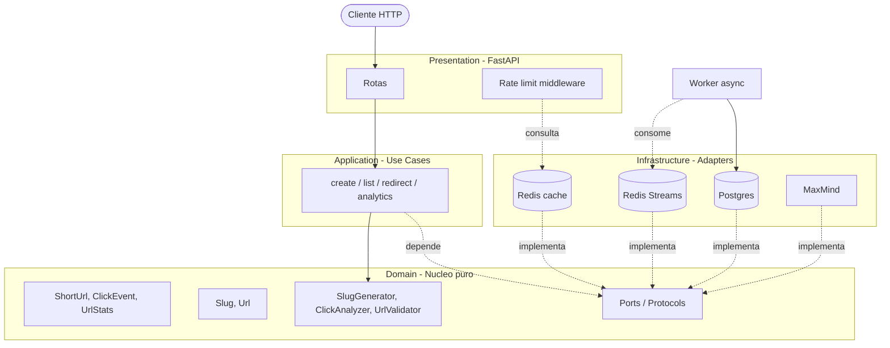

# Arquitetura

## Visao geral

Clean Architecture / Hexagonal — domínio puro no centro, frameworks nas bordas.

Diferencas em relacao ao projeto irmao (api_financa): foco em **performance** e **escala** em vez de logica de negocio rica. Cache (Redis), filas assincronas (Redis Streams) e analytics granulares sao cidadaos de primeira classe.

## Fluxo de redirect (caminho quente)

1. `GET /{slug}` chega
2. Cache Redis: `slug -> target_url`. Se hit -> 301/302 imediato (target ~5ms)
3. Cache miss -> consulta Postgres -> popula cache -> 301/302
4. Em paralelo (`BackgroundTasks`): publica evento de clique no Redis Stream
5. Worker (processo separado) consome stream, faz lookup geo via MaxMind, persiste em `click_events`
6. Job diario agrega `click_events` em `url_stats_daily`

Esse desenho mantem o redirect rapido e desacopla o registro de analytics, sem perder granularidade.

## Camadas

### Domain
- Entidades: `User`, `ShortUrl`, `ClickEvent`, `UrlStatsDaily`
- Value objects: `Slug`, `Url`, `GeoLocation`, `UserAgentInfo`
- Servicos puros: `SlugGenerator` (Strategy), `UrlValidator`, `ClickAnalyzer`
- Ports: `ShortUrlRepository`, `ClickEventRepository`, `CachePort`, `EventPublisherPort`, `GeoLookupPort`, `RateLimiterPort`

### Application
Use cases finos que orquestram o domínio:
- `CreateShortUrl`, `ListShortUrls`, `DeleteShortUrl`
- `ResolveSlug` (consulta cache, fallback no DB, dispara evento)
- `GetUrlStats`, `GetTimeline`, `GetGeoBreakdown`

### Infrastructure
- SQLAlchemy 2.0 async + asyncpg
- `redis-py` async para cache/streams
- `maxminddb` para lookup geo offline
- `user-agents` para parse de UA

### Presentation
- FastAPI + Pydantic v2
- Middleware de rate limiting (token bucket no Redis)
- Middleware de request_id

## Tradeoffs registrados nos ADRs

- 0001 — Clean Architecture
- 0002 — JWT manual
- 0003 — SQLAlchemy 2.0 async
- 0004 — Redis Streams + worker em vez de Celery
- 0005 — MaxMind local em vez de API externa
- 0006 — Analytics hibrido (eventos + agregacao diaria)
